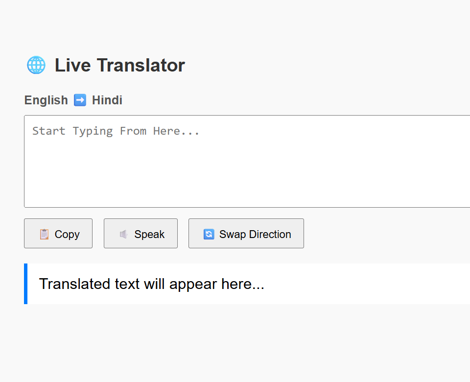

 🌐 Live Translation App (English ↔ Hindi)

This is a simple web-based live translation project that lets you convert words from **English to Hindi** and **Hindi to English**.

---

 🔴 Demo Screenshot

---

 🚀 Features
- Real-time translation
- Easy-to-use UI
- A speak feature
- Swapping feature
- copy-paste option directly
- Supports Hindi ⇌ English words

---

 🛠️ Technologies Used
- HTML
- Inline CSS
- JavaScript

---

 📥 How to Use
1. Type a word in English or Hindi.
2. Press Translate.
3. Get instant meaning in the opposite language.

---

 ✨ Author
Hritik Sen

---
